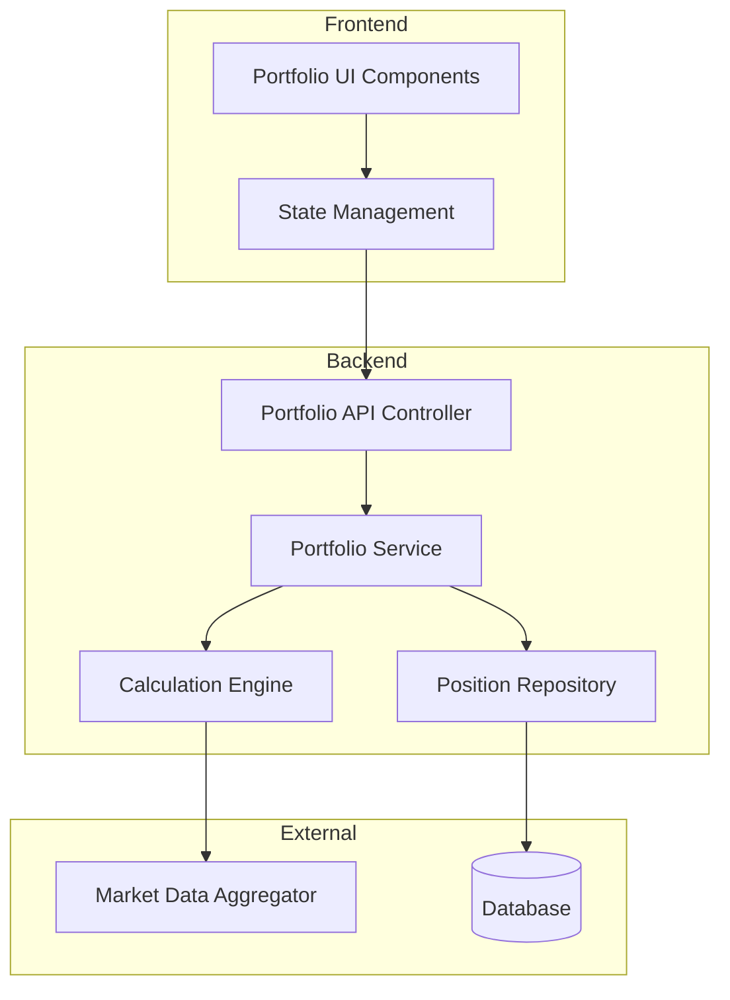

# Portfolio Tracking Module - Design Document

## Overview

The Portfolio Tracking module is a comprehensive system for manually tracking cryptocurrency holdings and monitoring investment performance. It consists of backend services for data management and calculation, and frontend components for visualization and interaction. The module integrates with the existing Market Data Aggregator to obtain current cryptocurrency prices for real-time portfolio valuation.

This is a tracking-only tool that does not execute trades, connect to exchange accounts, or provide investment guarantees. All positions are manually entered by users.

## Architecture

### High-Level Architecture



### Component Responsibilities

1. **Portfolio API Controller**: Handles HTTP requests, validates input, returns responses
2. **Portfolio Service**: Business logic orchestration, coordinates between repository and calculation engine
3. **Calculation Engine**: Performs all financial calculations (PnL, allocation, historical values)
4. **Position Repository**: Data access layer for CRUD operations on positions
5. **Market Data Aggregator**: Existing service providing current cryptocurrency prices
6. **Frontend Components**: React components for displaying portfolio data and charts

## Components and Interfaces

### Backend Components

#### Position Entity

```typescript
interface Position {
  id: string;                    // UUID
  userId: string;                // User identifier
  symbol: string;                // Cryptocurrency symbol (e.g., 'BTC-USDT')
  entryPrice: number;            // Price at which position was acquired
  amount: number;                // Quantity of cryptocurrency
  entryDate: Date;               // Date position was acquired
  createdAt: Date;               // Record creation timestamp
  updatedAt: Date;               // Record last update timestamp
}
```

#### Position with Metrics (Calculated View)

```typescript
interface PositionWithMetrics extends Position {
  currentPrice: number;          // Current market price
  currentValue: number;          // amount * currentPrice
  initialValue: number;          // amount * entryPrice
  unrealizedPnL: number;         // currentValue - initialValue
  pnLPercentage: number;         // (unrealizedPnL / initialValue) * 100
  priceTimestamp: number;        // Timestamp of current price
}
```

#### Portfolio Summary

```typescript
interface PortfolioSummary {
  totalValue: number;            // Sum of all position current values
  totalUnrealizedPnL: number;    // Sum of all position unrealized PnL
  totalPnLPercentage: number;    // (totalUnrealizedPnL / totalInitialValue) * 100
  positionCount: number;         // Number of positions
  lastUpdated: number;           // Timestamp of calculation
}
```

#### Allocation Data

```typescript
interface AllocationItem {
  symbol: string;
  value: number;
  percentage: number;
  color?: string;                // For chart rendering
}

interface PortfolioAllocation {
  items: AllocationItem[];
  totalValue: number;
  lastUpdated: number;
}
```

#### Historical Portfolio Value

```typescript
interface HistoricalDataPoint {
  timestamp: number;
  value: number;
}

interface HistoricalPortfolioValue {
  dataPoints: HistoricalDataPoint[];
  startDate: number;
  endDate: number;
}
```

### API Endpoints

#### Create Position
- **Method**: POST
- **Path**: `/api/portfolio/positions`
- **Request Body**: 
  ```typescript
  {
    symbol: string;
    entryPrice: number;
    amount: number;
    entryDate: string; // ISO 8601 format
  }
  ```
- **Response**: `Position` (201 Created)
- **Errors**: 400 (validation), 401 (unauthorized), 500 (server error)

#### Get All Positions
- **Method**: GET
- **Path**: `/api/portfolio/positions`
- **Query Parameters**: 
  - `includeMetrics`: boolean (default: true)
- **Response**: `PositionWithMetrics[]` (200 OK)
- **Errors**: 401 (unauthorized), 500 (server error)

#### Get Single Position
- **Method**: GET
- **Path**: `/api/portfolio/positions/:id`
- **Response**: `PositionWithMetrics` (200 OK)
- **Errors**: 401 (unauthorized), 404 (not found), 500 (server error)

#### Update Position
- **Method**: PUT
- **Path**: `/api/portfolio/positions/:id`
- **Request Body**: 
  ```typescript
  {
    symbol?: string;
    entryPrice?: number;
    amount?: number;
    entryDate?: string;
  }
  ```
- **Response**: `Position` (200 OK)
- **Errors**: 400 (validation), 401 (unauthorized), 404 (not found), 500 (server error)

#### Delete Position
- **Method**: DELETE
- **Path**: `/api/portfolio/positions/:id`
- **Response**: 204 No Content
- **Errors**: 401 (unauthorized), 404 (not found), 500 (server error)

#### Get Portfolio Summary
- **Method**: GET
- **Path**: `/api/portfolio/summary`
- **Response**: `PortfolioSummary` (200 OK)
- **Errors**: 401 (unauthorized), 500 (server error)

#### Get Portfolio Allocation
- **Method**: GET
- **Path**: `/api/portfolio/allocation`
- **Response**: `PortfolioAllocation` (200 OK)
- **Errors**: 401 (unauthorized), 500 (server error)

#### Get Historical Portfolio Value
- **Method**: GET
- **Path**: `/api/portfolio/history`
- **Query Parameters**:
  - `startDate`: string (ISO 8601)
  - `endDate`: string (ISO 8601)
  - `interval`: string ('1h' | '1d' | '1w')
- **Response**: `HistoricalPortfolioValue` (200 OK)
- **Errors**: 400 (validation), 401 (unauthorized), 500 (server error)

## Data Models

### Database Schema

#### Positions Table

```sql
CREATE TABLE positions (
  id UUID PRIMARY KEY DEFAULT gen_random_uuid(),
  user_id VARCHAR(255) NOT NULL,
  symbol VARCHAR(50) NOT NULL,
  entry_price DECIMAL(20, 8) NOT NULL,
  amount DECIMAL(20, 8) NOT NULL,
  entry_date TIMESTAMP NOT NULL,
  created_at TIMESTAMP DEFAULT CURRENT_TIMESTAMP,
  updated_at TIMESTAMP DEFAULT CURRENT_TIMESTAMP,
  
  CONSTRAINT positive_entry_price CHECK (entry_price > 0),
  CONSTRAINT positive_amount CHECK (amount > 0),
  CONSTRAINT valid_entry_date CHECK (entry_date <= CURRENT_TIMESTAMP)
);

CREATE INDEX idx_positions_user_id ON positions(user_id);
CREATE INDEX idx_positions_symbol ON positions(symbol);
CREATE INDEX idx_positions_entry_date ON positions(entry_date);
```

### Calculation Formulas

#### Current Value
```
currentValue = amount × currentPrice
```

#### Initial Value
```
initialValue = amount × entryPrice
```

#### Unrealized PnL
```
unrealizedPnL = currentValue - initialValue
```

#### PnL Percentage
```
pnLPercentage = (unrealizedPnL / initialValue) × 100
```

#### Total Portfolio Value
```
totalValue = Σ(position.currentValue) for all positions
```

#### Total Unrealized PnL
```
totalUnrealizedPnL = Σ(position.unrealizedPnL) for all positions
```

#### Total PnL Percentage
```
totalInitialValue = Σ(position.initialValue) for all positions
totalPnLPercentage = (totalUnrealizedPnL / totalInitialValue) × 100
```

#### Allocation Percentage
```
allocationPercentage = (position.currentValue / totalValue) × 100
```

## Correctness Properties


*A property is a characteristic or behavior that should hold true across all valid executions of a system—essentially, a formal statement about what the system should do. Properties serve as the bridge between human-readable specifications and machine-verifiable correctness guarantees.*

### Property 1: Position creation round-trip
*For any* valid position data (positive amount, positive entry price, non-future date), creating a position and then retrieving it should return equivalent data
**Validates: Requirements 1.1, 1.5**

### Property 2: Invalid position rejection
*For any* position with invalid data (negative/zero amount, negative/zero entry price, or future date), the system should reject the creation and return an error
**Validates: Requirements 1.2, 1.3, 1.4**

### Property 3: Position display completeness
*For any* position, the display representation should include all required fields: symbol, entry price, amount, entry date, current price, current value, unrealized PnL, and PnL percentage
**Validates: Requirements 2.1**

### Property 4: Current value calculation correctness
*For any* position and current market price, the calculated current value should equal amount × currentPrice
**Validates: Requirements 2.2**

### Property 5: Unrealized PnL calculation correctness
*For any* position, the unrealized PnL should equal (amount × currentPrice) - (amount × entryPrice)
**Validates: Requirements 2.3**

### Property 6: PnL percentage calculation correctness
*For any* position with non-zero initial value, the PnL percentage should equal ((unrealizedPnL / initialValue) × 100)
**Validates: Requirements 2.4**

### Property 7: Position update preserves identity
*For any* position, updating it with valid data should preserve the position's unique identifier
**Validates: Requirements 3.3**

### Property 8: Invalid update rejection
*For any* position update with invalid data, the system should reject the update and leave the position unchanged
**Validates: Requirements 3.2**

### Property 9: Position deletion removes record
*For any* position, deleting it should result in the position no longer being retrievable
**Validates: Requirements 4.1**

### Property 10: Total portfolio value is sum of positions
*For any* portfolio with positions, the total portfolio value should equal the sum of all position current values
**Validates: Requirements 5.1**

### Property 11: Total unrealized PnL is sum of position PnLs
*For any* portfolio with positions, the total unrealized PnL should equal the sum of all position unrealized PnLs
**Validates: Requirements 5.2**

### Property 12: Total PnL percentage calculation correctness
*For any* portfolio with non-zero total initial value, the total PnL percentage should equal ((totalUnrealizedPnL / totalInitialValue) × 100)
**Validates: Requirements 5.3**

### Property 13: Allocation percentages sum to 100
*For any* portfolio with positions, the sum of all allocation percentages should equal 100 (within floating-point tolerance)
**Validates: Requirements 6.1, 6.2**

### Property 14: Allocation calculation correctness
*For any* position in a portfolio, its allocation percentage should equal ((position.currentValue / totalPortfolioValue) × 100)
**Validates: Requirements 6.2**

### Property 15: Allocation completeness
*For any* portfolio, the allocation data should include an entry for every position with symbol and percentage
**Validates: Requirements 6.3**

### Property 16: Historical value calculation correctness
*For any* portfolio and historical time point, the portfolio value at that time should equal the sum of (position.amount × historicalPrice) for all positions existing at that time
**Validates: Requirements 7.2**

### Property 17: User data isolation
*For any* user, querying positions should return only positions belonging to that user
**Validates: Requirements 9.4**

### Property 18: API error responses include status and message
*For any* invalid API request, the response should include an appropriate HTTP status code and error message
**Validates: Requirements 10.7**

## Error Handling

### Input Validation Errors

The system validates all input data before processing:

1. **Negative or Zero Amount**: Return 400 Bad Request with message "Amount must be greater than zero"
2. **Negative or Zero Entry Price**: Return 400 Bad Request with message "Entry price must be greater than zero"
3. **Future Entry Date**: Return 400 Bad Request with message "Entry date cannot be in the future"
4. **Invalid Symbol Format**: Return 400 Bad Request with message "Invalid symbol format"
5. **Missing Required Fields**: Return 400 Bad Request with message "Missing required field: {fieldName}"

### Market Data Errors

When the Market Data Aggregator is unavailable or returns no data:

1. **Use Cached Price**: If a recent price exists (within last 5 minutes), use it with a timestamp indicator
2. **Display Warning**: Show a warning message to the user that prices may be stale
3. **Graceful Degradation**: Allow viewing positions with last known prices rather than failing completely

### Database Errors

1. **Connection Failures**: Return 503 Service Unavailable with retry-after header
2. **Constraint Violations**: Return 400 Bad Request with specific constraint error
3. **Not Found**: Return 404 Not Found for non-existent position IDs
4. **Duplicate Operations**: Handle idempotently where possible

### Authorization Errors

1. **Unauthenticated Requests**: Return 401 Unauthorized
2. **Accessing Other User's Data**: Return 403 Forbidden
3. **Invalid Tokens**: Return 401 Unauthorized with token refresh instructions

## Testing Strategy

### Unit Testing

Unit tests will verify specific examples and integration points:

1. **API Endpoint Tests**: Verify each endpoint responds correctly to valid and invalid requests
2. **Service Layer Tests**: Test business logic with mocked dependencies
3. **Repository Tests**: Verify database operations with test database
4. **Calculation Engine Tests**: Test specific calculation examples with known inputs/outputs
5. **Error Handling Tests**: Verify proper error responses for various failure scenarios

Example unit tests:
- Creating a position with valid data returns 201 and position object
- Deleting a non-existent position returns 404
- Empty portfolio returns zero for all summary metrics
- Disclaimer text is present on portfolio page

### Property-Based Testing

Property-based tests will verify universal properties across all inputs using **fast-check** (JavaScript/TypeScript property testing library):

1. **Configuration**: Each property test should run a minimum of 100 iterations
2. **Tagging**: Each property-based test must include a comment referencing the design document property
3. **Format**: Use this exact format: `// Feature: portfolio-tracking, Property {number}: {property_text}`
4. **Coverage**: Each correctness property must be implemented by a single property-based test

Property test generators will create:
- Random valid positions (positive amounts, positive prices, past dates)
- Random invalid positions (negative/zero amounts, negative/zero prices, future dates)
- Random portfolios with multiple positions
- Random price data from Market Data Aggregator
- Random user identifiers for isolation testing

Example property tests:
- For any valid position, creation followed by retrieval returns equivalent data (Property 1)
- For any position with invalid data, creation is rejected (Property 2)
- For any portfolio, sum of allocation percentages equals 100 (Property 13)
- For any user, querying positions returns only their positions (Property 17)

### Integration Testing

Integration tests will verify end-to-end workflows:

1. **Complete Position Lifecycle**: Create, read, update, delete a position
2. **Portfolio Calculation Pipeline**: Add positions, verify summary calculations with real Market Data Aggregator
3. **Multi-User Scenarios**: Verify data isolation between users
4. **Historical Data Generation**: Verify historical portfolio value calculation with time-series data

## Frontend Components

### Component Structure

```
Portfolio/
├── PortfolioPage.tsx           # Main container component
├── PortfolioSummary.tsx        # Summary cards (total value, PnL)
├── PositionsTable.tsx          # Table of all positions
├── AllocationChart.tsx         # Pie chart for allocation
├── HistoricalChart.tsx         # Line chart for historical value
├── AddPositionForm.tsx         # Form to add new position
├── EditPositionModal.tsx       # Modal to edit position
├── DisclaimerBanner.tsx        # Disclaimer text component
└── hooks/
    ├── usePositions.ts         # Hook for position CRUD
    ├── usePortfolioSummary.ts  # Hook for summary data
    └── useAllocation.ts        # Hook for allocation data
```

### PortfolioPage Component

```typescript
import React from 'react';
import { PortfolioSummary } from './PortfolioSummary';
import { PositionsTable } from './PositionsTable';
import { AllocationChart } from './AllocationChart';
import { HistoricalChart } from './HistoricalChart';
import { DisclaimerBanner } from './DisclaimerBanner';
import { usePositions } from './hooks/usePositions';
import { usePortfolioSummary } from './hooks/usePortfolioSummary';

export const PortfolioPage: React.FC = () => {
  const { positions, loading, error } = usePositions();
  const { summary } = usePortfolioSummary();

  return (
    <div className="portfolio-page">
      <DisclaimerBanner />
      
      <div className="portfolio-header">
        <h1>Portfolio Tracker</h1>
      </div>

      {error && <div className="error-message">{error}</div>}

      <PortfolioSummary summary={summary} loading={loading} />

      <div className="portfolio-grid">
        <div className="positions-section">
          <PositionsTable positions={positions} loading={loading} />
        </div>
        
        <div className="charts-section">
          <AllocationChart positions={positions} />
          <HistoricalChart />
        </div>
      </div>
    </div>
  );
};
```

### DisclaimerBanner Component

```typescript
import React from 'react';

export const DisclaimerBanner: React.FC = () => {
  return (
    <div className="disclaimer-banner" role="alert">
      <strong>⚠️ Disclaimer:</strong> This is a tracking tool only. 
      No automatic trading is performed. No profit guarantees are provided. 
      All positions are manually entered for tracking purposes.
    </div>
  );
};
```

### PortfolioSummary Component

```typescript
import React from 'react';
import { PortfolioSummary as SummaryData } from '../types';

interface Props {
  summary: SummaryData | null;
  loading: boolean;
}

export const PortfolioSummary: React.FC<Props> = ({ summary, loading }) => {
  if (loading) return <div>Loading...</div>;
  if (!summary) return null;

  const formatCurrency = (value: number) => 
    new Intl.NumberFormat('en-US', { 
      style: 'currency', 
      currency: 'USD' 
    }).format(value);

  const formatPercentage = (value: number) => 
    `${value >= 0 ? '+' : ''}${value.toFixed(2)}%`;

  return (
    <div className="portfolio-summary">
      <div className="summary-card">
        <h3>Total Value</h3>
        <p className="value">{formatCurrency(summary.totalValue)}</p>
      </div>

      <div className="summary-card">
        <h3>Unrealized PnL</h3>
        <p className={`value ${summary.totalUnrealizedPnL >= 0 ? 'positive' : 'negative'}`}>
          {formatCurrency(summary.totalUnrealizedPnL)}
        </p>
      </div>

      <div className="summary-card">
        <h3>PnL %</h3>
        <p className={`value ${summary.totalPnLPercentage >= 0 ? 'positive' : 'negative'}`}>
          {formatPercentage(summary.totalPnLPercentage)}
        </p>
      </div>

      <div className="summary-card">
        <h3>Positions</h3>
        <p className="value">{summary.positionCount}</p>
      </div>
    </div>
  );
};
```

### PositionsTable Component

```typescript
import React, { useState } from 'react';
import { PositionWithMetrics } from '../types';
import { AddPositionForm } from './AddPositionForm';
import { EditPositionModal } from './EditPositionModal';

interface Props {
  positions: PositionWithMetrics[];
  loading: boolean;
}

export const PositionsTable: React.FC<Props> = ({ positions, loading }) => {
  const [editingPosition, setEditingPosition] = useState<PositionWithMetrics | null>(null);
  const [showAddForm, setShowAddForm] = useState(false);

  if (loading) return <div>Loading positions...</div>;

  if (positions.length === 0) {
    return (
      <div className="empty-state">
        <p>No positions yet. Add your first position to start tracking!</p>
        <button onClick={() => setShowAddForm(true)}>Add Position</button>
        {showAddForm && <AddPositionForm onClose={() => setShowAddForm(false)} />}
      </div>
    );
  }

  return (
    <div className="positions-table-container">
      <div className="table-header">
        <h2>Positions</h2>
        <button onClick={() => setShowAddForm(true)}>Add Position</button>
      </div>

      <table className="positions-table">
        <thead>
          <tr>
            <th>Symbol</th>
            <th>Amount</th>
            <th>Entry Price</th>
            <th>Current Price</th>
            <th>Current Value</th>
            <th>Unrealized PnL</th>
            <th>PnL %</th>
            <th>Entry Date</th>
            <th>Actions</th>
          </tr>
        </thead>
        <tbody>
          {positions.map((position) => (
            <tr key={position.id}>
              <td>{position.symbol}</td>
              <td>{position.amount.toFixed(8)}</td>
              <td>${position.entryPrice.toFixed(2)}</td>
              <td>${position.currentPrice.toFixed(2)}</td>
              <td>${position.currentValue.toFixed(2)}</td>
              <td className={position.unrealizedPnL >= 0 ? 'positive' : 'negative'}>
                ${position.unrealizedPnL.toFixed(2)}
              </td>
              <td className={position.pnLPercentage >= 0 ? 'positive' : 'negative'}>
                {position.pnLPercentage >= 0 ? '+' : ''}{position.pnLPercentage.toFixed(2)}%
              </td>
              <td>{new Date(position.entryDate).toLocaleDateString()}</td>
              <td>
                <button onClick={() => setEditingPosition(position)}>Edit</button>
                <button onClick={() => handleDelete(position.id)}>Delete</button>
              </td>
            </tr>
          ))}
        </tbody>
      </table>

      {showAddForm && <AddPositionForm onClose={() => setShowAddForm(false)} />}
      {editingPosition && (
        <EditPositionModal 
          position={editingPosition} 
          onClose={() => setEditingPosition(null)} 
        />
      )}
    </div>
  );

  function handleDelete(id: string) {
    if (confirm('Are you sure you want to delete this position?')) {
      // Call delete API
    }
  }
};
```

### AllocationChart Component

```typescript
import React from 'react';
import { PieChart, Pie, Cell, ResponsiveContainer, Legend, Tooltip } from 'recharts';
import { PositionWithMetrics } from '../types';

interface Props {
  positions: PositionWithMetrics[];
}

const COLORS = ['#0088FE', '#00C49F', '#FFBB28', '#FF8042', '#8884D8', '#82CA9D'];

export const AllocationChart: React.FC<Props> = ({ positions }) => {
  if (positions.length === 0) {
    return (
      <div className="chart-empty-state">
        <p>No positions to display allocation</p>
      </div>
    );
  }

  const totalValue = positions.reduce((sum, p) => sum + p.currentValue, 0);
  
  const data = positions.map((position, index) => ({
    name: position.symbol,
    value: position.currentValue,
    percentage: ((position.currentValue / totalValue) * 100).toFixed(2),
    color: COLORS[index % COLORS.length]
  }));

  return (
    <div className="allocation-chart">
      <h3>Portfolio Allocation</h3>
      <ResponsiveContainer width="100%" height={300}>
        <PieChart>
          <Pie
            data={data}
            cx="50%"
            cy="50%"
            labelLine={false}
            label={({ name, percentage }) => `${name}: ${percentage}%`}
            outerRadius={80}
            fill="#8884d8"
            dataKey="value"
          >
            {data.map((entry, index) => (
              <Cell key={`cell-${index}`} fill={entry.color} />
            ))}
          </Pie>
          <Tooltip formatter={(value: number) => `$${value.toFixed(2)}`} />
          <Legend />
        </PieChart>
      </ResponsiveContainer>
    </div>
  );
};
```

### Custom Hooks

#### usePositions Hook

```typescript
import { useState, useEffect } from 'react';
import { PositionWithMetrics } from '../types';

export const usePositions = () => {
  const [positions, setPositions] = useState<PositionWithMetrics[]>([]);
  const [loading, setLoading] = useState(true);
  const [error, setError] = useState<string | null>(null);

  useEffect(() => {
    fetchPositions();
  }, []);

  const fetchPositions = async () => {
    try {
      setLoading(true);
      const response = await fetch('/api/portfolio/positions');
      if (!response.ok) throw new Error('Failed to fetch positions');
      const data = await response.json();
      setPositions(data);
      setError(null);
    } catch (err) {
      setError(err instanceof Error ? err.message : 'Unknown error');
    } finally {
      setLoading(false);
    }
  };

  const createPosition = async (positionData: CreatePositionDto) => {
    const response = await fetch('/api/portfolio/positions', {
      method: 'POST',
      headers: { 'Content-Type': 'application/json' },
      body: JSON.stringify(positionData)
    });
    if (!response.ok) throw new Error('Failed to create position');
    await fetchPositions();
  };

  const updatePosition = async (id: string, positionData: Partial<CreatePositionDto>) => {
    const response = await fetch(`/api/portfolio/positions/${id}`, {
      method: 'PUT',
      headers: { 'Content-Type': 'application/json' },
      body: JSON.stringify(positionData)
    });
    if (!response.ok) throw new Error('Failed to update position');
    await fetchPositions();
  };

  const deletePosition = async (id: string) => {
    const response = await fetch(`/api/portfolio/positions/${id}`, {
      method: 'DELETE'
    });
    if (!response.ok) throw new Error('Failed to delete position');
    await fetchPositions();
  };

  return {
    positions,
    loading,
    error,
    createPosition,
    updatePosition,
    deletePosition,
    refresh: fetchPositions
  };
};
```

## Implementation Notes

### Market Data Integration

The Portfolio Tracking module integrates with the existing Market Data Aggregator:

1. **Price Retrieval**: Use `aggregator.getAggregatedTicker(symbol)` to get current prices
2. **Price Caching**: Cache prices for 30 seconds to reduce load on aggregator
3. **Fallback Strategy**: If aggregator returns null, use last known price from cache
4. **Symbol Format**: Ensure position symbols match the aggregator's expected format (e.g., 'BTC-USDT')

### Performance Considerations

1. **Batch Calculations**: Calculate all position metrics in a single pass
2. **Database Indexing**: Index on user_id and symbol for fast queries
3. **Caching**: Cache portfolio summary and allocation for 30 seconds
4. **Pagination**: Implement pagination for users with many positions (>100)

### Security Considerations

1. **User Isolation**: Always filter positions by authenticated user ID
2. **Input Sanitization**: Validate and sanitize all user inputs
3. **Rate Limiting**: Implement rate limiting on API endpoints
4. **SQL Injection Prevention**: Use parameterized queries
5. **Authorization**: Verify user owns position before update/delete operations

### Future Enhancements

1. **Export Functionality**: Allow users to export portfolio data to CSV
2. **Price Alerts**: Notify users when positions reach target prices
3. **Tax Reporting**: Generate tax reports for realized gains
4. **Multiple Portfolios**: Allow users to create separate portfolios
5. **Transaction History**: Track all position changes over time
6. **Performance Analytics**: Show portfolio performance vs benchmarks
