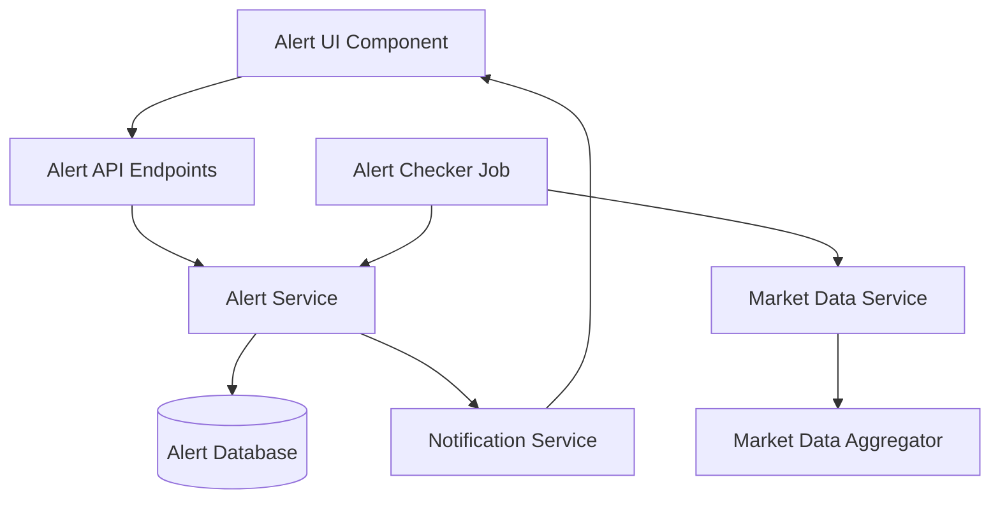

# Design Document

## Overview

The Price Alerts feature is a full-stack system that enables users to create, manage, and receive notifications for cryptocurrency price movements. The system consists of three main components: a backend alert management service, a background job scheduler for continuous monitoring, and a frontend UI for user interaction. The design emphasizes reliability, scalability, and clear user communication through mandatory disclaimers.

## Architecture

### High-Level Architecture



### Component Interaction Flow

1. **Alert Creation Flow**: User submits alert via UI → API validates and creates alert → Alert Service persists to database
2. **Alert Evaluation Flow**: Scheduler triggers → Alert Checker fetches active alerts → Retrieves market data → Evaluates conditions → Triggers matching alerts → Creates trigger logs
3. **Alert Display Flow**: User requests alert list → API fetches from database → UI renders with status and disclaimers

## Components and Interfaces

### Backend Components

#### Alert Entity Schema

```typescript
interface Alert {
  id: string;                    // Unique identifier (UUID)
  userId: string;                // User who created the alert
  symbol: string;                // Cryptocurrency symbol (e.g., "BTC/USDT")
  conditionType: AlertConditionType;
  thresholdValue: number;        // Price or percentage threshold
  status: AlertStatus;           // 'active' | 'triggered'
  createdAt: Date;
  triggeredAt?: Date;
}

enum AlertConditionType {
  PRICE_ABOVE = 'priceAbove',
  PRICE_BELOW = 'priceBelow',
  CHANGE_PERCENT_ABOVE = 'changePercentAbove',
  CHANGE_PERCENT_BELOW = 'changePercentBelow'
}

enum AlertStatus {
  ACTIVE = 'active',
  TRIGGERED = 'triggered'
}
```

#### Trigger Log Schema

```typescript
interface TriggerLog {
  id: string;
  alertId: string;
  triggeredAt: Date;
  marketPrice: number;
  percentageChange?: number;     // For percentage-based alerts
  disclaimer: string;            // Required disclaimer text
}
```

#### Alert Service Interface

```typescript
interface IAlertService {
  createAlert(userId: string, alertData: CreateAlertDto): Promise<Alert>;
  getAlertsByUser(userId: string): Promise<Alert[]>;
  deleteAlert(alertId: string, userId: string): Promise<void>;
  getActiveAlerts(): Promise<Alert[]>;
  triggerAlert(alertId: string, marketData: MarketSnapshot): Promise<TriggerLog>;
}

interface CreateAlertDto {
  symbol: string;
  conditionType: AlertConditionType;
  thresholdValue: number;
}

interface MarketSnapshot {
  symbol: string;
  currentPrice: number;
  priceChange24h?: number;
  percentageChange24h?: number;
}
```

#### Alert Checker Job

```typescript
interface IAlertChecker {
  evaluateAlerts(): Promise<void>;
  evaluateCondition(alert: Alert, marketData: MarketSnapshot): boolean;
}
```

### Frontend Components

#### Alert Creation Form Component

```typescript
interface AlertFormProps {
  onAlertCreated: (alert: Alert) => void;
}

interface AlertFormState {
  symbol: string;
  conditionType: AlertConditionType;
  thresholdValue: string;
  isSubmitting: boolean;
  error?: string;
}
```

#### Alert List Component

```typescript
interface AlertListProps {
  alerts: Alert[];
  triggerLogs: Map<string, TriggerLog>;
  onDeleteAlert: (alertId: string) => void;
}
```

## Data Models

### Database Schema

**alerts table:**
- id (UUID, primary key)
- user_id (string, indexed)
- symbol (string, indexed)
- condition_type (enum)
- threshold_value (decimal)
- status (enum, indexed)
- created_at (timestamp)
- triggered_at (timestamp, nullable)

**trigger_logs table:**
- id (UUID, primary key)
- alert_id (UUID, foreign key)
- triggered_at (timestamp)
- market_price (decimal)
- percentage_change (decimal, nullable)
- disclaimer (text)

### Indexes
- alerts: (user_id, status)
- alerts: (status, symbol) for efficient batch processing
- trigger_logs: (alert_id)

## Data Flow

### Alert Creation
1. User fills form with symbol, condition type, and threshold
2. Frontend validates input (non-empty symbol, positive numbers)
3. API endpoint receives POST request
4. Alert Service validates business rules
5. Alert persisted to database with 'active' status
6. Response returned to UI with created alert

### Alert Evaluation (Background Job)
1. Scheduler triggers every 60 seconds
2. Alert Checker fetches all active alerts from database
3. Groups alerts by symbol to batch market data requests
4. For each symbol, fetches current price and 24h change data
5. Evaluates each alert's condition against market data
6. For triggered alerts:
   - Updates alert status to 'triggered'
   - Sets triggeredAt timestamp
   - Creates trigger log with market data and disclaimer
7. Notification service processes triggered alerts

### Alert Display
1. User navigates to alerts page
2. Frontend requests alerts via API
3. Backend fetches alerts and associated trigger logs
4. Frontend renders:
   - Active alerts in one section
   - Triggered alerts with trigger details in another
   - Disclaimer prominently displayed

## Correc
tness Properties

*A property is a characteristic or behavior that should hold true across all valid executions of a system—essentially, a formal statement about what the system should do. Properties serve as the bridge between human-readable specifications and machine-verifiable correctness guarantees.*

### Property 1: Alert creation succeeds for all valid condition types

*For any* valid symbol, condition type (priceAbove, priceBelow, changePercentAbove, changePercentBelow), and positive threshold value, creating an alert should result in an alert entity with the specified parameters, active status, unique ID, and creation timestamp.

**Validates: Requirements 1.1, 1.2, 1.5, 2.1, 2.2**

### Property 2: Invalid symbols are rejected

*For any* invalid symbol format (empty string, whitespace-only, special characters only, excessively long strings), attempting to create an alert should result in rejection with an error message, and no alert should be persisted.

**Validates: Requirements 1.3**

### Property 3: Invalid threshold values are rejected

*For any* non-positive threshold value (zero, negative numbers) or invalid percentage value (negative, greater than 100 for some contexts), attempting to create an alert should result in rejection with an error message, and no alert should be persisted.

**Validates: Requirements 1.4, 2.3**

### Property 4: Percentage change calculation is correct

*For any* current price and 24-hour-ago price, the calculated percentage change should equal ((currentPrice - price24hAgo) / price24hAgo) * 100.

**Validates: Requirements 2.4**

### Property 5: Alert triggering is complete and correct

*For any* active alert where the condition is satisfied by market data, triggering the alert should result in: (1) alert status changed to 'triggered', (2) triggeredAt timestamp set, (3) trigger log created with correct market data values and required disclaimer text.

**Validates: Requirements 3.2, 3.3, 3.4, 7.1**

### Property 6: Alert evaluation continues despite errors

*For any* set of alerts where market data retrieval fails for some symbols, the alert checker should log errors for failed symbols and successfully evaluate alerts for symbols with available data.

**Validates: Requirements 3.5**

### Property 7: Alert list contains complete information

*For any* user's alerts, fetching the alert list should return all alerts with symbol, condition type, threshold value, status, and for triggered alerts, the trigger timestamp and market data values.

**Validates: Requirements 4.1, 4.3**

### Property 8: Alert list sorting is correct

*For any* mix of active and triggered alerts, the returned alert list should have all active alerts appearing before all triggered alerts.

**Validates: Requirements 4.4**

### Property 9: Alert deletion removes alert but preserves logs

*For any* alert (active or triggered), deleting the alert should result in the alert no longer being retrievable, but any associated trigger logs should remain accessible.

**Validates: Requirements 6.1, 6.2**

### Property 10: Condition evaluation is accurate

*For any* alert and market data:
- priceAbove: should trigger when currentPrice > thresholdValue
- priceBelow: should trigger when currentPrice < thresholdValue
- changePercentAbove: should trigger when percentageChange24h > thresholdValue
- changePercentBelow: should trigger when percentageChange24h < thresholdValue

**Validates: Requirements 3.2**

## Error Handling

### Validation Errors
- **Invalid Symbol**: Return 400 Bad Request with message "Invalid cryptocurrency symbol"
- **Invalid Threshold**: Return 400 Bad Request with message "Threshold value must be positive"
- **Missing Fields**: Return 400 Bad Request with specific field error messages

### Runtime Errors
- **Market Data Unavailable**: Log error, skip affected alerts, continue processing others
- **Database Connection Error**: Retry with exponential backoff, alert monitoring system if persistent
- **Alert Not Found**: Return 404 Not Found with message "Alert not found"
- **Unauthorized Access**: Return 403 Forbidden when user attempts to access/delete another user's alert

### Error Logging
All errors should be logged with:
- Timestamp
- Error type and message
- Context (alert ID, user ID, symbol)
- Stack trace for unexpected errors

## Testing Strategy

### Unit Testing

Unit tests will cover:
- Alert validation logic (symbol format, threshold values)
- Condition evaluation functions for each condition type
- Percentage change calculation
- Alert status transitions
- Error handling paths

### Property-Based Testing

We will use **fast-check** (for TypeScript/JavaScript) as our property-based testing library. Each property test will run a minimum of 100 iterations.

Property tests will verify:
- **Property 1**: Alert creation with randomly generated valid inputs produces correct alert entities
- **Property 2**: Invalid symbol generators produce rejection for all invalid formats
- **Property 3**: Non-positive and invalid threshold generators produce rejection
- **Property 4**: Random price pairs produce mathematically correct percentage calculations
- **Property 5**: Random alerts with satisfied conditions trigger completely (status, timestamp, log)
- **Property 6**: Random alert sets with simulated market data errors continue processing
- **Property 7**: Random user alert sets return complete information
- **Property 8**: Random mixed alert lists sort correctly
- **Property 9**: Random alert deletion preserves trigger logs
- **Property 10**: Random alert/market data pairs evaluate conditions correctly

Each property-based test will be tagged with the format: **Feature: price-alerts, Property {number}: {property_text}**

### Integration Testing

Integration tests will verify:
- End-to-end alert creation flow (API → Service → Database)
- Alert checker job execution with real market data service
- Alert triggering and notification flow
- Frontend component interaction with API

### Test Data Generators

For property-based testing, we'll create generators for:
- Valid cryptocurrency symbols (e.g., "BTC/USDT", "ETH/USDT")
- Invalid symbols (empty, whitespace, special chars)
- Positive and non-positive numbers
- Alert condition types
- Market data snapshots with various price scenarios
- Alert entities in different states

## Implementation Considerations

### Alert Checker Job Implementation

The background job should:
1. Use a job scheduler (e.g., node-cron, Bull queue)
2. Implement leader election if running multiple instances
3. Batch alerts by symbol to minimize market data API calls
4. Use database transactions when updating alert status and creating trigger logs
5. Implement circuit breaker pattern for market data service calls

### Scalability Considerations

- Use database connection pooling
- Implement caching for frequently accessed market data (with short TTL)
- Consider partitioning alerts table by status for large datasets
- Use message queue for notification delivery to decouple from alert evaluation

### Security Considerations

- Validate user ownership before alert operations
- Implement rate limiting on alert creation (e.g., max 50 alerts per user)
- Sanitize all user inputs to prevent injection attacks
- Use parameterized queries for all database operations

## UI Component Structure

### Alert Dashboard Layout

```
┌─────────────────────────────────────────┐
│  Price Alerts                           │
│  ⚠️ Disclaimer: Prices are volatile... │
├─────────────────────────────────────────┤
│  Create New Alert                       │
│  ┌─────────────────────────────────┐   │
│  │ Symbol: [BTC/USDT ▼]            │   │
│  │ Condition: [Price Above ▼]      │   │
│  │ Value: [________]               │   │
│  │ [Create Alert]                  │   │
│  └─────────────────────────────────┘   │
├─────────────────────────────────────────┤
│  Active Alerts (3)                      │
│  ┌─────────────────────────────────┐   │
│  │ 🔔 BTC/USDT > $50,000           │   │
│  │    Created: 2 hours ago    [×]  │   │
│  └─────────────────────────────────┘   │
│  ┌─────────────────────────────────┐   │
│  │ 🔔 ETH/USDT < $3,000            │   │
│  │    Created: 1 day ago      [×]  │   │
│  └─────────────────────────────────┘   │
├─────────────────────────────────────────┤
│  Triggered Alerts (2)                   │
│  ┌─────────────────────────────────┐   │
│  │ ✅ BTC/USDT > $48,000           │   │
│  │    Triggered: 3 hours ago       │   │
│  │    Price: $48,234.56       [×]  │   │
│  │    ⚠️ Informational only...     │   │
│  └─────────────────────────────────┘   │
└─────────────────────────────────────────┘
```

### Component Hierarchy

```
AlertDashboard
├── DisclaimerBanner
├── AlertForm
│   ├── SymbolSelect
│   ├── ConditionTypeSelect
│   └── ThresholdInput
├── ActiveAlertsList
│   └── AlertCard (multiple)
│       └── DeleteButton
└── TriggeredAlertsList
    └── TriggeredAlertCard (multiple)
        ├── TriggerDetails
        ├── DisclaimerText
        └── DeleteButton
```

## API Endpoints

### POST /api/alerts
Create a new alert
- Request body: `{ symbol, conditionType, thresholdValue }`
- Response: Created alert object
- Status codes: 201 Created, 400 Bad Request, 401 Unauthorized

### GET /api/alerts
Get all alerts for the authenticated user
- Response: Array of alert objects with trigger logs
- Status codes: 200 OK, 401 Unauthorized

### DELETE /api/alerts/:alertId
Delete an alert
- Response: Success message
- Status codes: 204 No Content, 403 Forbidden, 404 Not Found

### GET /api/alerts/triggered
Get triggered alerts with trigger logs
- Response: Array of triggered alerts with detailed trigger information
- Status codes: 200 OK, 401 Unauthorized

## Pseudocode for Alert Checker Job

```typescript
async function evaluateAlerts() {
  try {
    // Fetch all active alerts
    const activeAlerts = await alertService.getActiveAlerts();
    
    if (activeAlerts.length === 0) {
      return;
    }
    
    // Group alerts by symbol to batch market data requests
    const alertsBySymbol = groupBy(activeAlerts, 'symbol');
    const symbols = Object.keys(alertsBySymbol);
    
    // Fetch market data for all symbols
    const marketDataMap = await fetchMarketDataBatch(symbols);
    
    // Evaluate each alert
    for (const alert of activeAlerts) {
      try {
        const marketData = marketDataMap.get(alert.symbol);
        
        if (!marketData) {
          logger.error(`Market data unavailable for ${alert.symbol}`);
          continue; // Skip this alert, continue with others
        }
        
        // Evaluate condition
        const shouldTrigger = evaluateCondition(alert, marketData);
        
        if (shouldTrigger) {
          // Trigger alert in a transaction
          await database.transaction(async (trx) => {
            // Update alert status
            await trx('alerts')
              .where({ id: alert.id })
              .update({
                status: 'triggered',
                triggered_at: new Date()
              });
            
            // Create trigger log
            await trx('trigger_logs').insert({
              id: generateUUID(),
              alert_id: alert.id,
              triggered_at: new Date(),
              market_price: marketData.currentPrice,
              percentage_change: marketData.percentageChange24h,
              disclaimer: 'Prices are volatile, this is informational only, not financial advice.'
            });
          });
          
          // Send notification (async, non-blocking)
          notificationService.sendAlertNotification(alert, marketData);
        }
      } catch (error) {
        logger.error(`Error evaluating alert ${alert.id}:`, error);
        // Continue processing other alerts
      }
    }
  } catch (error) {
    logger.error('Error in alert evaluation job:', error);
  }
}

function evaluateCondition(alert: Alert, marketData: MarketSnapshot): boolean {
  switch (alert.conditionType) {
    case 'priceAbove':
      return marketData.currentPrice > alert.thresholdValue;
    
    case 'priceBelow':
      return marketData.currentPrice < alert.thresholdValue;
    
    case 'changePercentAbove':
      return marketData.percentageChange24h > alert.thresholdValue;
    
    case 'changePercentBelow':
      return marketData.percentageChange24h < alert.thresholdValue;
    
    default:
      return false;
  }
}

async function fetchMarketDataBatch(symbols: string[]): Promise<Map<string, MarketSnapshot>> {
  const marketDataMap = new Map();
  
  try {
    // Batch request to market data service
    const responses = await marketDataService.getBatchPrices(symbols);
    
    for (const [symbol, data] of Object.entries(responses)) {
      marketDataMap.set(symbol, {
        symbol,
        currentPrice: data.price,
        percentageChange24h: data.change24h
      });
    }
  } catch (error) {
    logger.error('Error fetching batch market data:', error);
  }
  
  return marketDataMap;
}

// Schedule the job to run every 60 seconds
cron.schedule('*/60 * * * * *', evaluateAlerts);
```

## Future Enhancements

- Email and push notification delivery
- Alert history and analytics
- Recurring alerts (re-arm after trigger)
- Complex conditions (AND/OR combinations)
- Alert templates and presets
- Alert sharing between users
- Mobile app support
