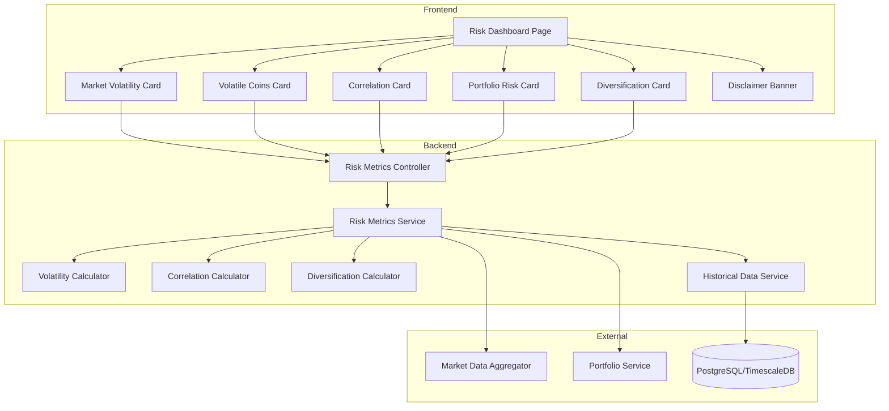

# Risk Dashboard - Design Document

## Overview

The Risk Dashboard is a comprehensive risk analysis module that provides cryptocurrency investors with market-wide volatility metrics, portfolio concentration analysis, and correlation insights. The system integrates with the existing Market Data Aggregator and Portfolio Tracking modules to compute statistical risk measures and present them through an intuitive, educational interface.

### Technology Stack

**Backend:**
- Framework: NestJS (consistent with existing architecture)
- Database: PostgreSQL with TimescaleDB for historical data queries
- Statistical Libraries: mathjs, simple-statistics
- Testing: Jest, fast-check for property-based testing

**Frontend:**
- Framework: React 18 with TypeScript
- State Management: Zustand
- Charts: Recharts for heat maps and visualizations
- Styling: Tailwind CSS

### Design Principles

1. **Educational Focus**: All metrics include tooltips with plain-language explanations
2. **Transparency**: Prominent disclaimers about approximate nature of risk metrics
3. **Performance**: Efficient computation with caching for expensive calculations
4. **Modularity**: Risk metrics service is independent and reusable
5. **Accuracy**: Statistical rigor in volatility and correlation calculations
6. **Graceful Degradation**: Handle missing data without breaking the dashboard

## Architecture

### High-Level Architecture



### Component Responsibilities

1. **Risk Metrics Controller**: Handles HTTP requests for market and portfolio risk data
2. **Risk Metrics Service**: Orchestrates risk calculations and data retrieval
3. **Volatility Calculator**: Computes standard deviation-based volatility metrics
4. **Correlation Calculator**: Computes Pearson correlation coefficients between assets
5. **Diversification Calculator**: Computes Herfindahl-Hirschman Index for portfolio concentration
6. **Historical Data Service**: Retrieves time-series price data from database
7. **Frontend Components**: React components for displaying risk metrics with tooltips and disclaimers

## Components and Interfaces

### Backend Components

#### 1. Risk Metrics Service

**Purpose:** Orchestrate risk calculations and aggregate data from multiple sources

**Key Components:**
- `RiskMetricsService`: Main service coordinating all risk calculations
- `VolatilityCalculator`: Statistical volatility computations
- `CorrelationCalculator`: Correlation matrix generation
- `DiversificationCalculator`: Portfolio concentration metrics
- `HistoricalDataService`: Time-series data retrieval

**Interfaces:**

```typescript
interface MarketRiskSummary {
  marketVolatility: number;              // Overall market volatility percentage
  volatilityLevel: 'low' | 'medium' | 'high' | 'extreme';
  topVolatileCoins: VolatileCoin[];
  correlationMatrix: CorrelationMatrix;
  timestamp: Date;
  dataQuality: DataQualityIndicator;
}

interface VolatileCoin {
  symbol: string;
  name: string;
  currentPrice: number;
  volatility24h: number;                 // Standard deviation as percentage
  priceChange24h: number;
  rank: number;
}

interface CorrelationMatrix {
  symbols: string[];                     // Top 5 cryptocurrencies
  matrix: number[][];                    // Correlation coefficients [-1, 1]
  period: string;                        // e.g., "30 days"
  timestamp: Date;
}

interface PortfolioRiskSummary {
  userId: string;
  concentrationRisk: ConcentrationRisk;
  diversificationIndex: DiversificationIndex;
  timestamp: Date;
  dataQuality: DataQualityIndicator;
}

interface ConcentrationRisk {
  top3Percentage: number;                // Percentage in top 3 holdings
  top3Holdings: Array<{
    symbol: string;
    percentage: number;
    value: number;
  }>;
  riskLevel: 'low' | 'medium' | 'high';
}

interface DiversificationIndex {
  score: number;                         // 0-100, higher is better
  level: 'poor' | 'fair' | 'good' | 'excellent';
  holdingsCount: number;
  herfindahlIndex: number;               // Raw HHI value
}

interface DataQualityIndicator {
  status: 'complete' | 'partial' | 'insufficient';
  missingDataPoints: number;
  totalDataPoints: number;
  warnings: string[];
}
```


#### 2. Volatility Calculator

**Purpose:** Compute statistical volatility measures from price data

**Interfaces:**

```typescript
interface VolatilityCalculator {
  // Calculate 24-hour volatility for a single coin
  calculate24hVolatility(priceData: PriceDataPoint[]): number;
  
  // Calculate market-wide volatility
  calculateMarketVolatility(symbols: string[]): Promise<number>;
  
  // Rank coins by volatility
  rankByVolatility(symbols: string[], limit: number): Promise<VolatileCoin[]>;
}

interface PriceDataPoint {
  timestamp: Date;
  price: number;
  volume?: number;
}

interface VolatilityResult {
  symbol: string;
  volatility: number;                    // Standard deviation as percentage
  mean: number;
  stdDev: number;
  dataPoints: number;
  period: string;
}
```

**Calculation Method:**

```typescript
// Volatility = Standard Deviation of Percentage Returns
// 1. Calculate hourly percentage returns: (price_t - price_t-1) / price_t-1 * 100
// 2. Compute standard deviation of returns
// 3. Result is volatility as percentage

function calculateVolatility(prices: number[]): number {
  const returns = [];
  for (let i = 1; i < prices.length; i++) {
    const percentageReturn = ((prices[i] - prices[i-1]) / prices[i-1]) * 100;
    returns.push(percentageReturn);
  }
  
  const mean = returns.reduce((sum, r) => sum + r, 0) / returns.length;
  const squaredDiffs = returns.map(r => Math.pow(r - mean, 2));
  const variance = squaredDiffs.reduce((sum, d) => sum + d, 0) / returns.length;
  const stdDev = Math.sqrt(variance);
  
  return stdDev;
}
```

#### 3. Correlation Calculator

**Purpose:** Compute correlation coefficients between cryptocurrency pairs

**Interfaces:**

```typescript
interface CorrelationCalculator {
  // Calculate correlation matrix for top N coins
  calculateCorrelationMatrix(symbols: string[], period: number): Promise<CorrelationMatrix>;
  
  // Calculate pairwise correlation
  calculatePairwiseCorrelation(symbol1: string, symbol2: string, period: number): Promise<number>;
}

interface CorrelationResult {
  symbol1: string;
  symbol2: string;
  coefficient: number;                   // Pearson correlation [-1, 1]
  dataPoints: number;
  period: string;
}
```

**Calculation Method:**

```typescript
// Pearson Correlation Coefficient
// r = Σ((x_i - x_mean)(y_i - y_mean)) / sqrt(Σ(x_i - x_mean)² * Σ(y_i - y_mean)²)

function calculatePearsonCorrelation(prices1: number[], prices2: number[]): number {
  if (prices1.length !== prices2.length || prices1.length === 0) {
    throw new Error('Price arrays must have equal non-zero length');
  }
  
  const n = prices1.length;
  const mean1 = prices1.reduce((sum, p) => sum + p, 0) / n;
  const mean2 = prices2.reduce((sum, p) => sum + p, 0) / n;
  
  let numerator = 0;
  let sumSq1 = 0;
  let sumSq2 = 0;
  
  for (let i = 0; i < n; i++) {
    const diff1 = prices1[i] - mean1;
    const diff2 = prices2[i] - mean2;
    numerator += diff1 * diff2;
    sumSq1 += diff1 * diff1;
    sumSq2 += diff2 * diff2;
  }
  
  const denominator = Math.sqrt(sumSq1 * sumSq2);
  return denominator === 0 ? 0 : numerator / denominator;
}
```

#### 4. Diversification Calculator

**Purpose:** Compute portfolio diversification metrics

**Interfaces:**

```typescript
interface DiversificationCalculator {
  // Calculate diversification index from portfolio holdings
  calculateDiversificationIndex(holdings: PortfolioHolding[]): DiversificationIndex;
  
  // Calculate concentration risk
  calculateConcentrationRisk(holdings: PortfolioHolding[]): ConcentrationRisk;
}

interface PortfolioHolding {
  symbol: string;
  value: number;                         // Current value in USD
  percentage: number;                    // Percentage of total portfolio
}
```

**Calculation Method:**

```typescript
// Herfindahl-Hirschman Index (HHI)
// HHI = Σ(percentage_i²) for all holdings
// Normalized Score = (1 - HHI_normalized) * 100
// where HHI_normalized = (HHI - 1/n) / (1 - 1/n)

function calculateHHI(holdings: PortfolioHolding[]): number {
  let hhi = 0;
  for (const holding of holdings) {
    const fraction = holding.percentage / 100;
    hhi += fraction * fraction;
  }
  return hhi;
}

function normalizeToDiversificationScore(hhi: number, n: number): number {
  if (n <= 1) return 0;
  
  const minHHI = 1 / n;                  // Perfect diversification
  const maxHHI = 1;                      // Complete concentration
  
  const normalizedHHI = (hhi - minHHI) / (maxHHI - minHHI);
  const score = (1 - normalizedHHI) * 100;
  
  return Math.max(0, Math.min(100, score));
}
```

#### 5. Historical Data Service

**Purpose:** Retrieve time-series price data efficiently from database

**Interfaces:**

```typescript
interface HistoricalDataService {
  // Get hourly prices for volatility calculation
  getHourlyPrices(symbol: string, hours: number): Promise<PriceDataPoint[]>;
  
  // Get daily prices for correlation calculation
  getDailyPrices(symbols: string[], days: number): Promise<Map<string, PriceDataPoint[]>>;
  
  // Get latest prices for multiple symbols
  getLatestPrices(symbols: string[]): Promise<Map<string, number>>;
}

interface TimeSeriesQuery {
  symbol: string;
  startTime: Date;
  endTime: Date;
  interval: '1h' | '1d';
}
```

### API Endpoints

#### Get Market Risk Summary
- **Method**: GET
- **Path**: `/api/v1/risk/market-summary`
- **Query Parameters**: None
- **Response**: `MarketRiskSummary` (200 OK)
- **Errors**: 500 (server error), 503 (insufficient data)

#### Get Portfolio Risk Summary
- **Method**: GET
- **Path**: `/api/v1/risk/portfolio-summary`
- **Authentication**: Required
- **Response**: `PortfolioRiskSummary` (200 OK)
- **Errors**: 401 (unauthorized), 404 (no portfolio), 500 (server error)

#### Get Volatile Coins
- **Method**: GET
- **Path**: `/api/v1/risk/volatile-coins`
- **Query Parameters**:
  - `limit`: number (default: 10, max: 50)
- **Response**: `VolatileCoin[]` (200 OK)
- **Errors**: 400 (invalid parameters), 500 (server error)

#### Get Correlation Matrix
- **Method**: GET
- **Path**: `/api/v1/risk/correlation-matrix`
- **Query Parameters**:
  - `symbols`: string[] (optional, defaults to top 5 by market cap)
  - `period`: number (days, default: 30)
- **Response**: `CorrelationMatrix` (200 OK)
- **Errors**: 400 (invalid parameters), 500 (server error)

## Data Models

### Database Schema

The Risk Dashboard primarily reads from existing tables but may cache computed metrics:

#### Risk Metrics Cache Table (Optional)

```sql
CREATE TABLE risk_metrics_cache (
  id UUID PRIMARY KEY DEFAULT gen_random_uuid(),
  metric_type VARCHAR(50) NOT NULL,     -- 'market_volatility', 'correlation_matrix', etc.
  metric_key VARCHAR(255),               -- Additional identifier (e.g., symbol)
  metric_value JSONB NOT NULL,
  computed_at TIMESTAMP NOT NULL,
  expires_at TIMESTAMP NOT NULL,
  
  CONSTRAINT valid_metric_type CHECK (metric_type IN (
    'market_volatility',
    'coin_volatility',
    'correlation_matrix',
    'portfolio_risk'
  ))
);

CREATE INDEX idx_risk_metrics_type_key ON risk_metrics_cache(metric_type, metric_key);
CREATE INDEX idx_risk_metrics_expires ON risk_metrics_cache(expires_at);
```

### Calculation Formulas

#### Market Volatility
```
1. Get hourly prices for top 10 coins by market cap over 24 hours
2. Calculate volatility for each coin
3. Market volatility = weighted average of individual volatilities
   Weight = coin's 24h volume / total volume
```

#### Coin Volatility (24h)
```
1. Get hourly prices for last 24 hours (24 data points)
2. Calculate hourly returns: r_i = (P_i - P_{i-1}) / P_{i-1} * 100
3. Volatility = standard deviation of returns
```

#### Correlation Coefficient
```
Pearson correlation between two price series:
r = Σ((x_i - x̄)(y_i - ȳ)) / √(Σ(x_i - x̄)² * Σ(y_i - ȳ)²)

Where:
- x_i, y_i are prices at time i
- x̄, ȳ are mean prices
```

#### Concentration Risk
```
1. Sort holdings by value (descending)
2. Sum percentages of top 3 holdings
3. Risk level:
   - Low: < 50%
   - Medium: 50-70%
   - High: > 70%
```

#### Diversification Index
```
1. Calculate HHI = Σ(percentage_i / 100)² for all holdings
2. Normalize: HHI_norm = (HHI - 1/n) / (1 - 1/n)
3. Score = (1 - HHI_norm) * 100
4. Level:
   - Poor: 0-40
   - Fair: 40-60
   - Good: 60-80
   - Excellent: 80-100
```


## Correctness Properties

*A property is a characteristic or behavior that should hold true across all valid executions of a system—essentially, a formal statement about what the system should do. Properties serve as the bridge between human-readable specifications and machine-verifiable correctness guarantees.*

### Property 1: Volatility calculation correctness
*For any* price series with at least 2 data points, the calculated volatility should equal the standard deviation of percentage returns computed as ((price_i - price_{i-1}) / price_{i-1} * 100)
**Validates: Requirements 1.2, 2.2**

### Property 2: Volatile coin display completeness
*For any* volatile coin entry in the dashboard, the display should include coin name, symbol, current price, and 24-hour volatility percentage
**Validates: Requirements 2.3**

### Property 3: Missing data exclusion
*For any* cryptocurrency without sufficient price data, the system should exclude it from volatility rankings
**Validates: Requirements 2.5**

### Property 4: Pearson correlation calculation correctness
*For any* two price series of equal length with at least 2 data points, the calculated correlation coefficient should match the Pearson formula: r = Σ((x_i - x̄)(y_i - ȳ)) / √(Σ(x_i - x̄)² * Σ(y_i - ȳ)²)
**Validates: Requirements 3.2**

### Property 5: Correlation color mapping consistency
*For any* correlation coefficient value, the color mapping function should assign warm colors for values closer to 1 and cool colors for values closer to -1
**Validates: Requirements 3.3**

### Property 6: Concentration risk calculation correctness
*For any* portfolio with at least 3 holdings, the concentration risk percentage should equal the sum of the top 3 holdings' percentages
**Validates: Requirements 4.2**

### Property 7: Diversification index calculation correctness
*For any* portfolio with holdings, the diversification index should be computed as (1 - HHI_normalized) * 100, where HHI_normalized = (HHI - 1/n) / (1 - 1/n) and HHI = Σ(percentage_i / 100)²
**Validates: Requirements 5.2**

### Property 8: Diversification score bounds
*For any* portfolio, the diversification index score should be between 0 and 100 inclusive
**Validates: Requirements 5.2**

### Property 9: Insufficient data handling
*For any* metric computation where historical data is insufficient, the system should return null for that metric with an appropriate status indicator
**Validates: Requirements 7.3**

### Property 10: Error response structure
*For any* computation error in the Risk Metrics Service, the API response should include a 500 status code and an error message describing the failure
**Validates: Requirements 7.5**

## Error Handling

### Data Availability Errors

The system must gracefully handle missing or insufficient data:

1. **Insufficient Price Data**: If fewer than 24 hourly data points exist for volatility calculation, return null with status "insufficient_data"
2. **Missing Correlation Data**: If any symbol in correlation matrix lacks 30 days of data, exclude that symbol and note in warnings
3. **Empty Portfolio**: If user has no holdings, return appropriate message instead of attempting calculations
4. **Stale Data**: If cached data is older than TTL, recompute or return with "stale" indicator

### Calculation Errors

1. **Division by Zero**: Handle edge cases where standard deviation denominator is zero (constant prices)
2. **NaN Results**: Validate all calculations and return error if NaN is produced
3. **Outlier Detection**: Flag and potentially exclude extreme outliers that could skew metrics
4. **Numerical Precision**: Use appropriate precision for financial calculations (avoid floating-point errors)

### API Errors

1. **Authentication Failures**: Return 401 for unauthenticated portfolio risk requests
2. **Invalid Parameters**: Return 400 with specific validation error messages
3. **Service Unavailable**: Return 503 if dependent services (Market Data, Portfolio) are down
4. **Timeout**: Return 504 if calculations exceed reasonable time limits

### Frontend Error Handling

1. **Loading States**: Display skeleton loaders while data is being fetched
2. **Error Messages**: Show user-friendly error messages for failed requests
3. **Partial Data**: Display available metrics even if some fail to load
4. **Retry Logic**: Implement exponential backoff for failed requests

## Testing Strategy

### Unit Testing

Unit tests will verify specific examples and integration points:

1. **Volatility Calculator Tests**: Test calculation with known price series and expected results
2. **Correlation Calculator Tests**: Test Pearson correlation with known data sets
3. **Diversification Calculator Tests**: Test HHI calculation and normalization with example portfolios
4. **API Endpoint Tests**: Verify each endpoint responds correctly to valid and invalid requests
5. **Error Handling Tests**: Verify proper error responses for various failure scenarios
6. **Edge Case Tests**: Test with empty portfolios, single holdings, constant prices, etc.

Example unit tests:
- Volatility of constant prices returns 0
- Correlation of identical series returns 1
- Correlation of perfectly inverse series returns -1
- Empty portfolio returns appropriate message
- Portfolio with 1 holding has diversification score of 0
- Concentration risk with 2 holdings only sums those 2

### Property-Based Testing

Property-based tests will verify universal properties across all inputs using **fast-check** (JavaScript/TypeScript property testing library):

1. **Configuration**: Each property test should run a minimum of 100 iterations
2. **Tagging**: Each property-based test must include a comment referencing the design document property
3. **Format**: Use this exact format: `// Feature: risk-dashboard, Property {number}: {property_text}`
4. **Coverage**: Each correctness property must be implemented by a single property-based test

Property test generators will create:
- Random price series with varying lengths and values
- Random portfolios with different numbers of holdings and distributions
- Random correlation matrices
- Edge cases like empty data, single data points, extreme values

Example property tests:
- For any price series, volatility is non-negative (Property 1)
- For any two price series, correlation is between -1 and 1 (Property 4)
- For any portfolio, diversification score is between 0 and 100 (Property 8)
- For any portfolio with N holdings, concentration risk ≤ 100% (Property 6)
- For any volatile coin entry, all required fields are present (Property 2)

### Integration Testing

Integration tests will verify end-to-end workflows:

1. **Market Risk Flow**: Request market summary, verify all components are present and calculated
2. **Portfolio Risk Flow**: Create portfolio, request risk summary, verify calculations
3. **Data Pipeline**: Verify historical data retrieval → calculation → API response
4. **Caching Behavior**: Verify metrics are cached and invalidated appropriately
5. **Multi-User Scenarios**: Verify portfolio risk isolation between users

## Frontend Components

### Component Structure

```
RiskDashboard/
├── RiskDashboardPage.tsx           # Main container component
├── DisclaimerBanner.tsx            # Prominent disclaimer component
├── MarketVolatilityCard.tsx        # Market-wide volatility metric
├── VolatileCoinsCard.tsx           # Top 10 volatile coins list
├── CorrelationMatrixCard.tsx       # Heat map visualization
├── PortfolioRiskCard.tsx           # Concentration risk (auth required)
├── DiversificationCard.tsx         # Diversification index (auth required)
├── MetricTooltip.tsx               # Reusable tooltip component
├── LoadingCard.tsx                 # Loading state component
└── hooks/
    ├── useMarketRisk.ts            # Hook for market risk data
    ├── usePortfolioRisk.ts         # Hook for portfolio risk data
    └── useRiskMetrics.ts           # Shared risk metrics logic
```


### RiskDashboardPage Component

```typescript
import React from 'react';
import { DisclaimerBanner } from './DisclaimerBanner';
import { MarketVolatilityCard } from './MarketVolatilityCard';
import { VolatileCoinsCard } from './VolatileCoinsCard';
import { CorrelationMatrixCard } from './CorrelationMatrixCard';
import { PortfolioRiskCard } from './PortfolioRiskCard';
import { DiversificationCard } from './DiversificationCard';
import { useMarketRisk } from './hooks/useMarketRisk';
import { usePortfolioRisk } from './hooks/usePortfolioRisk';
import { useAuth } from '../auth/useAuth';

export const RiskDashboardPage: React.FC = () => {
  const { isAuthenticated } = useAuth();
  const { marketRisk, loading: marketLoading, error: marketError } = useMarketRisk();
  const { portfolioRisk, loading: portfolioLoading, error: portfolioError } = usePortfolioRisk();

  return (
    <div className="risk-dashboard-page">
      <DisclaimerBanner />
      
      <div className="dashboard-header">
        <h1>Risk Dashboard</h1>
        <p className="subtitle">
          Understand market volatility, correlation, and portfolio concentration
        </p>
      </div>

      {/* Market-wide metrics */}
      <section className="market-metrics">
        <h2>Market Risk Metrics</h2>
        <div className="metrics-grid">
          <MarketVolatilityCard 
            data={marketRisk?.marketVolatility} 
            loading={marketLoading}
            error={marketError}
          />
          <VolatileCoinsCard 
            data={marketRisk?.topVolatileCoins} 
            loading={marketLoading}
            error={marketError}
          />
          <CorrelationMatrixCard 
            data={marketRisk?.correlationMatrix} 
            loading={marketLoading}
            error={marketError}
          />
        </div>
      </section>

      {/* Portfolio-specific metrics (authenticated users only) */}
      {isAuthenticated && (
        <section className="portfolio-metrics">
          <h2>Your Portfolio Risk</h2>
          <div className="metrics-grid">
            <PortfolioRiskCard 
              data={portfolioRisk?.concentrationRisk} 
              loading={portfolioLoading}
              error={portfolioError}
            />
            <DiversificationCard 
              data={portfolioRisk?.diversificationIndex} 
              loading={portfolioLoading}
              error={portfolioError}
            />
          </div>
        </section>
      )}
    </div>
  );
};
```

### DisclaimerBanner Component

```typescript
import React from 'react';

export const DisclaimerBanner: React.FC = () => {
  return (
    <div className="disclaimer-banner" role="alert">
      <div className="disclaimer-icon">⚠️</div>
      <div className="disclaimer-content">
        <strong>Important Disclaimer:</strong>
        <p>
          All risk metrics displayed are approximate and based on historical data. 
          Past volatility and correlations do not guarantee future market behavior. 
          Diversification does not eliminate all investment risk. 
          These metrics are educational tools and should not be the sole basis for investment decisions.
        </p>
      </div>
    </div>
  );
};
```

### MarketVolatilityCard Component

```typescript
import React from 'react';
import { MetricTooltip } from './MetricTooltip';
import { LoadingCard } from './LoadingCard';

interface Props {
  data?: {
    marketVolatility: number;
    volatilityLevel: 'low' | 'medium' | 'high' | 'extreme';
    timestamp: Date;
  };
  loading: boolean;
  error?: string;
}

export const MarketVolatilityCard: React.FC<Props> = ({ data, loading, error }) => {
  if (loading) return <LoadingCard title="Market Volatility" />;
  if (error) return <div className="error-card">Error loading market volatility</div>;
  if (!data) return <div className="empty-card">No data available</div>;

  const getVolatilityColor = (level: string) => {
    switch (level) {
      case 'low': return 'text-green-600';
      case 'medium': return 'text-yellow-600';
      case 'high': return 'text-orange-600';
      case 'extreme': return 'text-red-600';
      default: return 'text-gray-600';
    }
  };

  const showWarning = data.marketVolatility > 10;

  return (
    <div className="metric-card">
      <div className="card-header">
        <h3>Overall Market Volatility</h3>
        <MetricTooltip content="Volatility measures how much prices fluctuate. Higher values indicate greater price instability and risk. This metric is calculated using the standard deviation of price changes across major cryptocurrencies." />
      </div>
      
      <div className="card-body">
        <div className={`metric-value ${getVolatilityColor(data.volatilityLevel)}`}>
          {data.marketVolatility.toFixed(2)}%
          {showWarning && <span className="warning-icon ml-2">⚠️</span>}
        </div>
        <div className="metric-label">
          24-Hour Volatility • {data.volatilityLevel.toUpperCase()}
        </div>
        <div className="metric-timestamp">
          Updated: {new Date(data.timestamp).toLocaleTimeString()}
        </div>
      </div>
    </div>
  );
};
```

### VolatileCoinsCard Component

```typescript
import React from 'react';
import { MetricTooltip } from './MetricTooltip';
import { LoadingCard } from './LoadingCard';

interface VolatileCoin {
  symbol: string;
  name: string;
  currentPrice: number;
  volatility24h: number;
  priceChange24h: number;
  rank: number;
}

interface Props {
  data?: VolatileCoin[];
  loading: boolean;
  error?: string;
}

export const VolatileCoinsCard: React.FC<Props> = ({ data, loading, error }) => {
  if (loading) return <LoadingCard title="Most Volatile Coins" />;
  if (error) return <div className="error-card">Error loading volatile coins</div>;
  if (!data || data.length === 0) return <div className="empty-card">No data available</div>;

  return (
    <div className="metric-card volatile-coins-card">
      <div className="card-header">
        <h3>Most Volatile Coins (24h)</h3>
        <MetricTooltip content="These are the cryptocurrencies with the highest price volatility in the last 24 hours. High volatility means larger price swings and potentially higher risk." />
      </div>
      
      <div className="card-body">
        <table className="volatile-coins-table">
          <thead>
            <tr>
              <th>Rank</th>
              <th>Coin</th>
              <th>Price</th>
              <th>Volatility</th>
              <th>24h Change</th>
            </tr>
          </thead>
          <tbody>
            {data.map((coin) => (
              <tr key={coin.symbol} className="coin-row">
                <td>{coin.rank}</td>
                <td>
                  <div className="coin-info">
                    <span className="coin-symbol">{coin.symbol}</span>
                    <span className="coin-name">{coin.name}</span>
                  </div>
                </td>
                <td>${coin.currentPrice.toFixed(2)}</td>
                <td className="volatility-cell">
                  <span className="volatility-badge">
                    {coin.volatility24h.toFixed(2)}%
                  </span>
                </td>
                <td className={coin.priceChange24h >= 0 ? 'positive' : 'negative'}>
                  {coin.priceChange24h >= 0 ? '+' : ''}
                  {coin.priceChange24h.toFixed(2)}%
                </td>
              </tr>
            ))}
          </tbody>
        </table>
      </div>
    </div>
  );
};
```

### CorrelationMatrixCard Component

```typescript
import React from 'react';
import { MetricTooltip } from './MetricTooltip';
import { LoadingCard } from './LoadingCard';

interface CorrelationMatrix {
  symbols: string[];
  matrix: number[][];
  period: string;
  timestamp: Date;
}

interface Props {
  data?: CorrelationMatrix;
  loading: boolean;
  error?: string;
}

export const CorrelationMatrixCard: React.FC<Props> = ({ data, loading, error }) => {
  if (loading) return <LoadingCard title="Correlation Matrix" />;
  if (error) return <div className="error-card">Error loading correlation data</div>;
  if (!data) return <div className="empty-card">No data available</div>;

  const getCorrelationColor = (value: number): string => {
    // Warm colors for positive correlation, cool colors for negative
    if (value >= 0.8) return 'bg-red-500';
    if (value >= 0.5) return 'bg-orange-400';
    if (value >= 0.2) return 'bg-yellow-300';
    if (value >= -0.2) return 'bg-gray-300';
    if (value >= -0.5) return 'bg-blue-300';
    if (value >= -0.8) return 'bg-blue-500';
    return 'bg-blue-700';
  };

  return (
    <div className="metric-card correlation-card">
      <div className="card-header">
        <h3>Price Correlation Matrix</h3>
        <MetricTooltip content="Correlation shows how cryptocurrency prices move together. Values near +1 mean they move in the same direction, values near -1 mean they move in opposite directions, and values near 0 mean little relationship. Historical correlation does not guarantee future price relationships." />
      </div>
      
      <div className="card-body">
        <div className="correlation-matrix">
          <table>
            <thead>
              <tr>
                <th></th>
                {data.symbols.map((symbol) => (
                  <th key={symbol}>{symbol}</th>
                ))}
              </tr>
            </thead>
            <tbody>
              {data.symbols.map((symbol1, i) => (
                <tr key={symbol1}>
                  <th>{symbol1}</th>
                  {data.symbols.map((symbol2, j) => {
                    const value = data.matrix[i][j];
                    return (
                      <td 
                        key={`${symbol1}-${symbol2}`}
                        className={`correlation-cell ${getCorrelationColor(value)}`}
                        title={`${symbol1} vs ${symbol2}: ${value.toFixed(3)}`}
                      >
                        {value.toFixed(2)}
                      </td>
                    );
                  })}
                </tr>
              ))}
            </tbody>
          </table>
        </div>
        <div className="correlation-legend">
          <span className="legend-item">
            <span className="legend-color bg-blue-700"></span> Strong Negative
          </span>
          <span className="legend-item">
            <span className="legend-color bg-gray-300"></span> No Correlation
          </span>
          <span className="legend-item">
            <span className="legend-color bg-red-500"></span> Strong Positive
          </span>
        </div>
        <div className="metric-info">
          Period: {data.period} • Updated: {new Date(data.timestamp).toLocaleTimeString()}
        </div>
        <div className="correlation-disclaimer">
          ⚠️ Historical correlation does not guarantee future price relationships
        </div>
      </div>
    </div>
  );
};
```

### PortfolioRiskCard Component

```typescript
import React from 'react';
import { MetricTooltip } from './MetricTooltip';
import { LoadingCard } from './LoadingCard';

interface ConcentrationRisk {
  top3Percentage: number;
  top3Holdings: Array<{
    symbol: string;
    percentage: number;
    value: number;
  }>;
  riskLevel: 'low' | 'medium' | 'high';
}

interface Props {
  data?: ConcentrationRisk;
  loading: boolean;
  error?: string;
}

export const PortfolioRiskCard: React.FC<Props> = ({ data, loading, error }) => {
  if (loading) return <LoadingCard title="Concentration Risk" />;
  if (error) return <div className="error-card">Error loading portfolio risk</div>;
  if (!data) {
    return (
      <div className="empty-card">
        <p>Portfolio risk metrics are unavailable</p>
        <p className="text-sm">Add holdings to your portfolio to see concentration analysis</p>
      </div>
    );
  }

  const getRiskColor = (level: string) => {
    switch (level) {
      case 'low': return 'text-green-600';
      case 'medium': return 'text-yellow-600';
      case 'high': return 'text-red-600';
      default: return 'text-gray-600';
    }
  };

  const showWarning = data.top3Percentage > 70;

  return (
    <div className="metric-card">
      <div className="card-header">
        <h3>Portfolio Concentration Risk</h3>
        <MetricTooltip content="Concentration risk measures how much of your portfolio is held in your top 3 assets. High concentration means you're more exposed to individual asset price movements. Generally, less than 50% in top 3 holdings indicates good diversification." />
      </div>
      
      <div className="card-body">
        <div className={`metric-value ${getRiskColor(data.riskLevel)}`}>
          {data.top3Percentage.toFixed(1)}%
          {showWarning && <span className="warning-icon ml-2">⚠️</span>}
        </div>
        <div className="metric-label">
          Held in Top 3 Assets • {data.riskLevel.toUpperCase()} RISK
        </div>
        
        {showWarning && (
          <div className="warning-message">
            Your portfolio may lack diversification. Consider spreading investments across more assets.
          </div>
        )}

        <div className="top-holdings">
          <h4>Top 3 Holdings:</h4>
          <ul>
            {data.top3Holdings.map((holding) => (
              <li key={holding.symbol}>
                <span className="holding-symbol">{holding.symbol}</span>
                <span className="holding-percentage">{holding.percentage.toFixed(1)}%</span>
                <span className="holding-value">${holding.value.toFixed(2)}</span>
              </li>
            ))}
          </ul>
        </div>

        <div className="additional-disclaimer">
          ⚠️ Diversification does not eliminate all investment risk
        </div>
      </div>
    </div>
  );
};
```

### DiversificationCard Component

```typescript
import React from 'react';
import { MetricTooltip } from './MetricTooltip';
import { LoadingCard } from './LoadingCard';

interface DiversificationIndex {
  score: number;
  level: 'poor' | 'fair' | 'good' | 'excellent';
  holdingsCount: number;
  herfindahlIndex: number;
}

interface Props {
  data?: DiversificationIndex;
  loading: boolean;
  error?: string;
}

export const DiversificationCard: React.FC<Props> = ({ data, loading, error }) => {
  if (loading) return <LoadingCard title="Diversification Index" />;
  if (error) return <div className="error-card">Error loading diversification data</div>;
  if (!data) {
    return (
      <div className="empty-card">
        <p>Diversification metrics are unavailable</p>
        <p className="text-sm">Add holdings to your portfolio to see diversification analysis</p>
      </div>
    );
  }

  if (data.holdingsCount < 3) {
    return (
      <div className="metric-card">
        <div className="card-header">
          <h3>Diversification Index</h3>
          <MetricTooltip content="The diversification index measures how evenly distributed your holdings are across different assets. Higher scores (closer to 100) indicate better diversification. This metric is most meaningful with 3 or more holdings." />
        </div>
        <div className="card-body">
          <div className="info-message">
            Diversification metrics are most meaningful with broader holdings. 
            You currently have {data.holdingsCount} holding{data.holdingsCount === 1 ? '' : 's'}.
          </div>
        </div>
      </div>
    );
  }

  const getLevelColor = (level: string) => {
    switch (level) {
      case 'excellent': return 'text-green-600';
      case 'good': return 'text-blue-600';
      case 'fair': return 'text-yellow-600';
      case 'poor': return 'text-red-600';
      default: return 'text-gray-600';
    }
  };

  const showWarning = data.score < 40;

  return (
    <div className="metric-card">
      <div className="card-header">
        <h3>Diversification Index</h3>
        <MetricTooltip content="The diversification index measures how evenly distributed your holdings are across different assets. Higher scores (closer to 100) indicate better diversification. The score is calculated using the Herfindahl-Hirschman Index, normalized to a 0-100 scale." />
      </div>
      
      <div className="card-body">
        <div className={`metric-value ${getLevelColor(data.level)}`}>
          {data.score.toFixed(0)}/100
          {showWarning && <span className="warning-icon ml-2">⚠️</span>}
        </div>
        <div className="metric-label">
          Diversification Score • {data.level.toUpperCase()}
        </div>
        
        <div className="score-bar">
          <div 
            className="score-fill" 
            style={{ width: `${data.score}%` }}
          />
        </div>

        <div className="holdings-info">
          <span>Holdings: {data.holdingsCount}</span>
          <span>HHI: {data.herfindahlIndex.toFixed(4)}</span>
        </div>

        {showWarning && (
          <div className="warning-message">
            Your portfolio shows low diversification. Consider adding more assets or rebalancing holdings.
          </div>
        )}
      </div>
    </div>
  );
};
```

### Custom Hooks

#### useMarketRisk Hook

```typescript
import { useState, useEffect } from 'react';
import { MarketRiskSummary } from '../types';

export const useMarketRisk = () => {
  const [marketRisk, setMarketRisk] = useState<MarketRiskSummary | null>(null);
  const [loading, setLoading] = useState(true);
  const [error, setError] = useState<string | null>(null);

  useEffect(() => {
    fetchMarketRisk();
    
    // Refresh every 60 seconds
    const interval = setInterval(fetchMarketRisk, 60000);
    return () => clearInterval(interval);
  }, []);

  const fetchMarketRisk = async () => {
    try {
      setLoading(true);
      const response = await fetch('/api/v1/risk/market-summary');
      if (!response.ok) throw new Error('Failed to fetch market risk data');
      const data = await response.json();
      setMarketRisk(data);
      setError(null);
    } catch (err) {
      setError(err instanceof Error ? err.message : 'Unknown error');
    } finally {
      setLoading(false);
    }
  };

  return { marketRisk, loading, error, refresh: fetchMarketRisk };
};
```

#### usePortfolioRisk Hook

```typescript
import { useState, useEffect } from 'react';
import { PortfolioRiskSummary } from '../types';
import { useAuth } from '../../auth/useAuth';

export const usePortfolioRisk = () => {
  const { isAuthenticated } = useAuth();
  const [portfolioRisk, setPortfolioRisk] = useState<PortfolioRiskSummary | null>(null);
  const [loading, setLoading] = useState(true);
  const [error, setError] = useState<string | null>(null);

  useEffect(() => {
    if (!isAuthenticated) {
      setLoading(false);
      return;
    }

    fetchPortfolioRisk();
    
    // Refresh every 60 seconds
    const interval = setInterval(fetchPortfolioRisk, 60000);
    return () => clearInterval(interval);
  }, [isAuthenticated]);

  const fetchPortfolioRisk = async () => {
    try {
      setLoading(true);
      const response = await fetch('/api/v1/risk/portfolio-summary');
      if (response.status === 404) {
        // No portfolio found
        setPortfolioRisk(null);
        setError(null);
        return;
      }
      if (!response.ok) throw new Error('Failed to fetch portfolio risk data');
      const data = await response.json();
      setPortfolioRisk(data);
      setError(null);
    } catch (err) {
      setError(err instanceof Error ? err.message : 'Unknown error');
    } finally {
      setLoading(false);
    }
  };

  return { portfolioRisk, loading, error, refresh: fetchPortfolioRisk };
};
```

## Implementation Notes

### Integration with Existing Modules

1. **Market Data Aggregator**: Use existing aggregator to get current prices and historical data
2. **Portfolio Service**: Integrate with portfolio tracking to get user holdings
3. **TimescaleDB**: Leverage time-series optimizations for efficient historical queries
4. **Caching Strategy**: Cache computed metrics for 5 minutes to reduce computational load

### Performance Considerations

1. **Computation Caching**: Cache volatility and correlation calculations with appropriate TTL
2. **Database Indexing**: Ensure indexes on timestamp and symbol columns for fast queries
3. **Batch Processing**: Calculate metrics for multiple symbols in parallel
4. **Lazy Loading**: Load portfolio risk only for authenticated users
5. **Progressive Enhancement**: Show available metrics even if some calculations fail

### Security Considerations

1. **User Isolation**: Ensure portfolio risk data is only accessible to the owning user
2. **Rate Limiting**: Implement rate limits on risk API endpoints
3. **Input Validation**: Validate all query parameters (symbols, periods, limits)
4. **SQL Injection Prevention**: Use parameterized queries for all database operations

### Future Enhancements

1. **Historical Risk Tracking**: Track how portfolio risk metrics change over time
2. **Risk Alerts**: Notify users when volatility or concentration exceeds thresholds
3. **Comparative Analysis**: Compare portfolio risk to market benchmarks
4. **Custom Correlation Pairs**: Allow users to select specific pairs for correlation analysis
5. **Risk Score**: Aggregate multiple metrics into a single risk score
6. **Scenario Analysis**: Show how portfolio risk would change with different allocations
